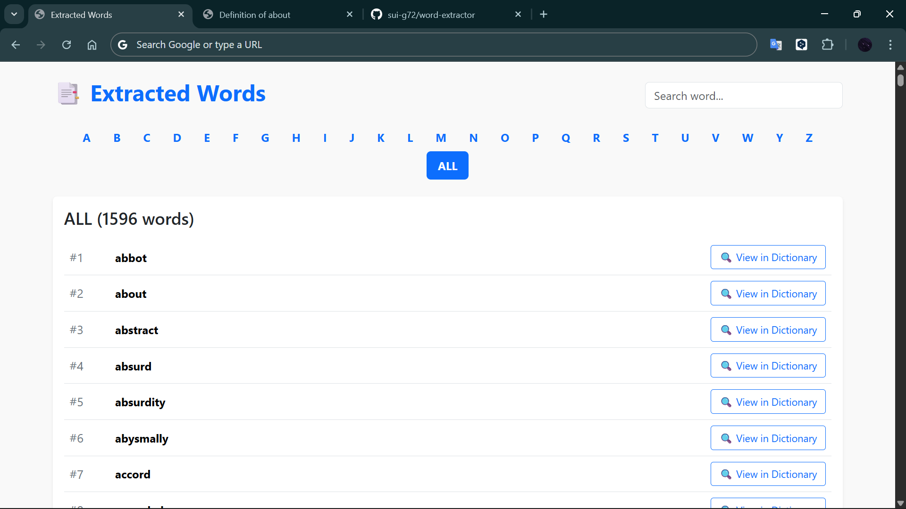

# 📖 Word Extractor

PDF または Web ページから英単語を自動抽出し、アルファベット順に分類して表示できる Web アプリです。

## 🚀 主な機能
- PDF からの英単語抽出
- Web ページ URL からの英単語抽出
- 単語を A-Z で分類表示
- 単語リストを重複排除
- シンプルで直感的な UI

## 🛠 使用技術
| 項目 | 使用技術 |
|---|---|
| Backend | Spring Boot (Java) |
| Template Engine | Thymeleaf |
| Frontend | Bootstrap 5 |
| Parsing | Jsoup / PDFBox |
| Build Tool | Maven |

## 🗂️ Screenshots

| Top | Word List | Definition |
|---|---|---|
|  |  |  |

## 💡 使い方
1. PDF ファイルをアップロード または Web サイトの URL を入力
2. 「解析」をクリック
3. 抽出された単語が A〜Z に分類されて表示されます

## 🗂 ディレクトリ構成
src

└ main

├ java (コントローラ / サービス)

└ resources

└ templates (Thymeleaf テンプレート)

## 👤 開発者
- Name: 後藤己航（ゴトウナツ）
- GitHub: https://github.com/sui-g72
