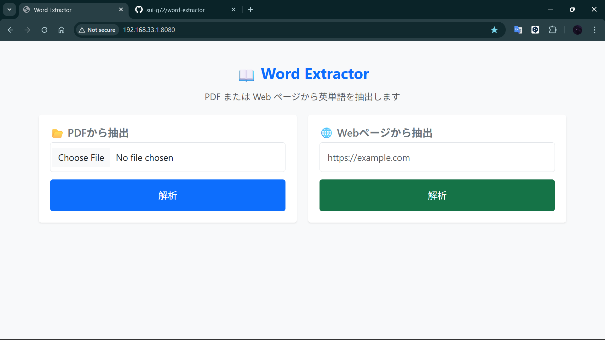
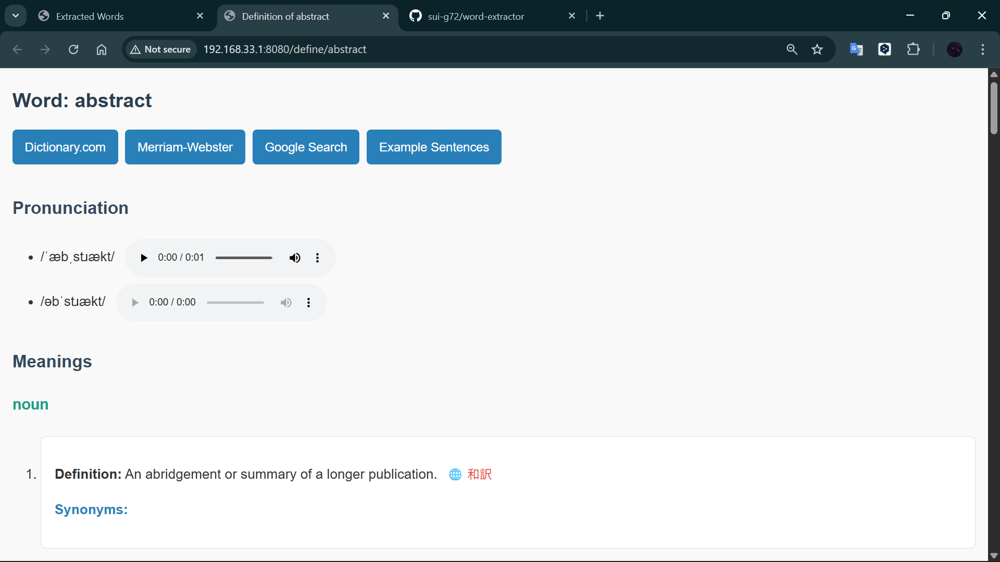

# 📖 Word Extractor
英語長文から「新出単語だけ」を効率よく抽出・学習できる Web アプリ


長文の英語を読むときに「知らない単語だけを効率よく拾いたい」と感じた経験から開発した、  
**PDF / Webページから英単語を抽出し、アルファベット順に整理して表示できる語彙学習支援 Web アプリ**です。

> 「全文翻訳はしたくない、でも語彙は整理したい」  
そんなニーズに応えます。

---

## 🚀 デモ
https://word-extractor.onrender.com  
（無料ホスティングのため初回アクセスは数秒かかる場合があります）

---

## 🎯 目的 / 背景
英語学習中に、**新出単語を拾って整理する作業が面倒**だと感じていました。  
既存の翻訳ツールは文章全体の翻訳は得意ですが、**語彙を抽出して一覧化する用途には不向き**です。

そこで以下を解決するために作成しました：

- 長文から **単語だけを抽出したい**
- 単語を **視覚的に整理して学習に使いたい**
- **辞書情報や和訳をすぐ確認したい**

---

## 🛸 主な機能
| 機能 | 説明 |
|---|---|
| PDF から英単語抽出 | PDFBox によりテキスト抽出し、正規表現で英単語を抽出 |
| Web ページから抽出 | Jsoup で HTML をパースし、不要タグを除去して抽出精度を向上 |
| A〜Z で分類表示 | 単語学習時の視認性を高める UI |
| 重複排除 | `Set` を用いてシンプルかつ高速に実装 |
| 辞書ビュー | 発音・英語定義を表示し、文脈理解に対応 |
| 🌐 DeepL 和訳リンク | 英語定義から即座に和訳へ遷移できる |

---

## 💡 UI / UX のこだわり
- 単語一覧を **アルファベットタブ** で整理→ 見たい単語にアクセスしやすい
- 意味表示は **画面遷移せずモーダル表示** → 学習体験を中断しない
- Bootstrap による **軽量で馴染みやすいデザイン**

---

## 🛠 使用技術
| 項目 | 使用技術 | 理由 |
|---|---|---|
| Backend | Spring Boot (Java) | MVC構成が明確で保守性が高いため |
| Template Engine | Thymeleaf | HTML と自然に統合できる |
| Frontend | Bootstrap 5 | UI試作が早く、視認性が高い |
| Parsing | Jsoup / PDFBox | Web / PDF の抽出用途に最適 |
| Build Tool | Maven | 依存と構成管理がシンプル |

---

## 📸 スクリーンショット

| Top | Word List | Definition |
|---|---|---|
|  |  |  |

---

## 🔧 ローカルで実行する
```bash
git clone https://github.com/sui-g72/word-extractor.git
cd word-extractor
mvn spring-boot:run
```

---

## 📈 今後の発展予定
| 内容 | 目的 |
|---|---|
| 単語出現頻度ランキング | 学習の優先順位を可視化 |
| 単語帳保存 / ユーザー認証 | 学習継続を支援 |
| React 版 UI | フロント分離による保守性の向上 |
---

👤 開発者
後藤己航（ゴトウナツ）
GitHub: https://github.com/sui-g72

---

「学習の困りごと」を起点に、
設計 → 実装 → 改善を繰り返したプロジェクトです。

